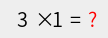

# zyan/captcha

加减乘除计算图形验证码



## 要求

1. php >= 7.3
2. Composer

## 安装

```shell
composer require zyan/captcha -vvv
```
## 用法

```php
use Zyan\Captcha\Captcha;

$config = [
    'width' => 108, //宽度
    'height' => 38, //高度
    'background' => '#eee', //底色
    'font_size' => 20, //字体大小
    'session' => true //使用sessoin保存及验证
];

$captcha = Captcha::make($config); //$cofnig 为可选,默认为上参数
```

保存验证码图片

```php
$captcha->save($filename);
```

获取计算值(用于自己验证)

```php
$captcha->getCode();
```

通过session验证是否通过
```php
$captcha->verify($code); //如通过验证,会清除session
```

## 参与贡献

1. fork 当前库到你的名下
2. 在你的本地修改完成审阅过后提交到你的仓库
3. 提交 PR 并描述你的修改，等待合并

## License

[MIT license](https://opensource.org/licenses/MIT)
